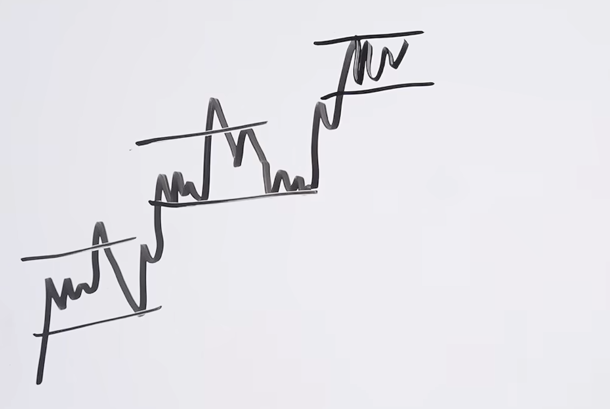
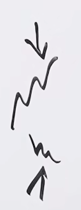
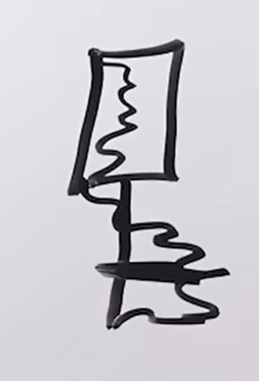
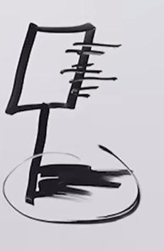

- It is not about entry models, setups, candlesticks, and patterns.
- What am I participating in?
- Who are the other participants?
- What are they trying to do?
- What are their limitations?
- Where do they forced to participatte?
- Updated todo list
- Build context around trade ideas
- End up entries, setup it comes down to the final 5-10%
- Confirming/denying trade ideas is valid
- Focus on execution
- Day trader, intra day trader
- At 1.5 hour of New York open or somtimes Asia session
- you have buyers and sellers
- you are positioning
- Market purpose to determine value of the asset
- when market ballaced, defined range, no one forced to participate, They are building positions.
- Wen on side become more agressive, they start to force participation
- when you are buyer and you are in a position and tradi is agains you
  - defend that position
  - add more into the position
  - get out of the position
  - sell
- Looking for not ballaced market
- Looking for starting force of participation on either edge.
- Looking for failing force of participation on either edge.
  - it creted traped participants
  - they are offside
  - 50 points 100 points
  - mean reversion
- Where we building value
- How are we moving out of it
- whn they are traped we trying to make adventages ov it 
- Context Location and confirmation
- Step 1 Environment
  - understand the market Structure
    - Value up
    - Value down 
    - sideways
    - We creting value between peeks
      
  - Understand what the higher time frames are doing
    - 1 hour somtimes 4 hour chart
    - What has the week been doung
    - What has the preevious week been doung
    - Higher highs hier lows 
  - 2. Understanding Gamma or Gex
    - I use Naive Gex  
      - I like looking at NQ  levels
      - QQQ. NDX, CBOE doesnt have the data for that
      - to making a very broad assumption
      - I dont want necesaraly looking bounce off yhe put or ca;; walls
      - I want to understand the environment we are in
    - Inferred Gex: 
      - how they calculate their models to determine the levels
      - models or calculations to determine more granularity in terms of dealer positioning
      - CBOE date is expensive and it is only for SPX, ES, S&P 500 and 300$/month
    - GEX (Gamma Exposure)
      - it is importtant beccase of options market the largest 
      - Positive GEX
        - they may think long, becase it is green
        - but that is wrong
        - We have to think about this in terms of Volatility
          - selling into the rips
          - buying into the dips
          - 
      - Negative GEX
        - they may think short
        - buying into the rips
        - selling into the dips
      - 
    - So this high valume of often buy and sel case more volatility
    - Tanuki Trade: https://tanukitrade.com/ 50$/per month
    - So e.g we have a value up structure + a negative gamma environment
      - doent men mecesaraly we are going down
      - it just means that the volatility may be amplified
      - We see biger move , faster moves
      - I wnat to understand before the market actualy opens
        - where the call walls is
        - where the put wall is
        - where the gamma fip zone is  (when you are entering +/= territory)
- 2 Location
  - I want to understand where do I want to do busines?
  - I dont want to go against the value up structure
  - I wai[text](IQCapital.sum.md)t for descount, when we are below of fair value
  - But I don't  sell at premium, when we areabove of fair value. It could potentialy potentially continue the expansion.
  - The explosion itself is qick and dificult to predict or catch and conduct busuiness around it.
  - if the explosion low valume node
  - after explosion it settle in a value range
  - Thhen at NewYork open
  - then the open, open up in range, then starts dropping under the value area low to the discount  
  - Don't panic and sell it here.
- 3 Confirmation
  - how do I now it is a valid level? 
    - Check order flow 
      - standard candle stick shows open, high, low and close, but that is just the result of the underlying order flow.
      - candles with Volume profile
        - 
        - All the volume is down
        - POC (Point of Control), where the most amount of contracts are concentrated
      - candles with Delta profile (5 min)
        -  
        - All the delta is negative (right), so it is sellers  
      - So we can see in structure up environment, 
        after explosion and temporary setelment 
        participants gett to the descount location.
      - Their agression to haveily sell, but they fail at down
      - That is an extrame absorption in descount area.
      - Now candle flips bulish
      - Looloing for next candle to open up to immediately pull back
      - looking for aggression again, but this time I want it to fail at a higher up. Bullish , 
      - Looking for shift of dominance back to the upside buyers
        - candle closed bullish  
        - next candle to open up to immadiatly pull back
         
        - I am loolking for aggression happen the sellers again, but this time I want it to fail at a higher up. Bullish , going long
        - entering the trade here
        - Put stop loss on the other side of the failed sellers