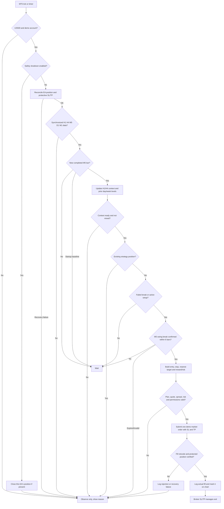

# Free-Data Price-Only Strategy Design

## Purpose and limits

This is a testable demo strategy inspired by Chris Creamer's process: context, location, failed auction, confirmation, then risk-defined execution. It uses only the OHLC price bars and broker quote data available for US500 in the MetaQuotes demo account. It does not reproduce Chris's options gamma, volume profile, footprint, bid/ask order flow, or MNQ futures strategy. A failed breakout is inferred from price; participant positions are not observable.

No profitability is assumed. The EA must remain demo-only while the rules and implementation are evaluated.

## Strategy rules

### Market and data

- Instrument: `US500` on the MetaQuotes demo feed.
- Context: completed H1 and H4 candles; use the existing two-bars-on-each-side confirmed swing definition.
- Setup and confirmation: completed M5 candles only.
- Levels: previous completed broker-day high/low and previous completed broker-week high/low. Use broker timestamps consistently; never mix local London time with server time.
- Do not use the currently forming candle to confirm a swing, reclaim, or breakout.

### Deterministic setup

Evaluate each level independently, once per completed M5 candle.

1. **Context gate:** Do not take a long when both H1 and H4 are `FALLING`. Do not take a short when both are `RISING`. `MIXED` or insufficient context is recorded and produces no trade until both timeframes have enough history to classify.
2. **Location:** Price must reach a previous-day or previous-week high/low.
3. **Failed break:** For a long, an M5 candle must trade below a prior low and close back above that level. For a short, it must trade above a prior high and close back below it. The candle's extreme is the failed-break extreme.
4. **Confirmation window:** Within the next six completed M5 candles, price must close beyond a confirmed M5 swing in the reversal direction. The swing must form after the failed-break candle and use two completed candles on each side. If confirmation does not occur in six bars, expire the setup.
5. **Entry:** At the first available quote after the confirmation candle closes, request one demo market order in the reversal direction, but only if all data, quote, spread, and risk checks pass. Never enter twice for the same level and failed-break event.
6. **Stop and target:** Put the stop one symbol tick beyond the failed-break extreme. Target the nearest opposing previous-day/week level beyond entry. Skip the trade if no such target exists or projected reward is less than 1.5 times the stop distance. No averaging down, widening stops, or adding to a position.
7. **Exit:** Close on stop, target, or a configured safety shutdown. Do not invent a trailing rule in this version.

Long and short rules are mirror images. Conflicting simultaneous signals mean no trade. One open strategy position per symbol is allowed; position sizing, daily loss limit, and spread ceiling must be explicitly configured and validated before order submission. Missing or invalid risk settings block trading.

## Signal lifecycle

```text
STARTUP_CHECK
  -> WAIT_FOR_COMPLETE_DATA
  -> WAIT_FOR_LEVEL_TOUCH
  -> WAIT_FOR_FAILED_BREAK_RECLAIM
  -> WAIT_FOR_M5_SWING_CONFIRMATION (maximum 6 completed bars)
  -> RISK_AND_EXECUTION_CHECK
  -> POSITION_OPEN
  -> CLOSED
```

Any failed data, quote, trading-permission, or risk check returns to a safe no-entry state with a reason. Expired or invalidated setup state is cleared. On restart, the EA reconciles an existing strategy position, then baselines the latest completed M5 candle. An in-progress setup is discarded so a stale signal cannot cause an entry.



## Architecture and ownership

Each class owns one responsibility and lives in its own header. Public methods orchestrate private single-purpose methods. Strategy calculations do not submit orders or draw chart objects.

| Class | Owns | Public orchestration |
|---|---|---|
| `CLearningEA` | MT5 event lifecycle and component wiring | `Initialize`, `ProcessIncomingTick`, `ProcessTimerEvent`, `Shutdown` |
| `CMarketDataService` | Rates, quotes, synchronization and freshness checks | `IsHistoryReady`, `LoadCompletedBars`, `GetCurrentQuote` |
| `CMarketContextAnalyzer` | H1/H4 confirmed swings and directional context | `Analyze` |
| `CReferenceLevelCalculator` | Previous completed day/week highs and lows | `Calculate` |
| `CFailedBreakoutDetector` | M5 level sweep and close-back-through detection | `Evaluate` |
| `CM5StructureConfirmation` | Post-sweep confirmed swing break | `Evaluate` |
| `CSetupStateMachine` | Failed-break lifecycle, invalidation and six-bar expiry | `ProcessCompletedBar` |
| `CTradePlanBuilder` | Entry, stop, target and projected reward/risk | `BuildPlan` |
| `CRiskGate` | Demo mode, settings, position count, sizing, daily limits and quote/spread checks | `Validate` |
| `COrderExecution` | Submit, verify, reconcile and close MT5 positions | `Open`, `Reconcile`, `Close` |
| `CPositionManager` | Strategy position lookup and daily performance limits | `HasStrategyPosition`, `ValidateDailyLimits` |
| `CStrategyObserver` | Structured strategy decision logs | `RecordEvent` |
| `CPriceOnlyStrategyVisualizer` | Draw/update/remove strategy chart objects only | `Render`, `Clear` |

Suggested source layout:

```text
src/Include/LearningEA/
  LearningEAController.mqh
  MarketDataService.mqh
  MarketContextAnalyzer.mqh
  ReferenceLevelCalculator.mqh
  FailedBreakoutDetector.mqh
  M5StructureConfirmation.mqh
  SetupStateMachine.mqh
  TradePlanBuilder.mqh
  RiskGate.mqh
  OrderExecution.mqh
  PositionManager.mqh
  StrategyObserver.mqh
  PriceOnlyStrategyVisualizer.mqh
  StrategyDirection.mqh
  StrategyLevel.mqh
  StrategySetup.mqh
  StrategyTradePlan.mqh
  StrategySettings.mqh
  MarketContextSnapshot.mqh
```

Dependencies flow from the controller to services and domain components. Detectors and plan builders receive data and return results; they do not call MT5 order functions. Only `COrderExecution` may submit or close orders, and it accepts a plan only after `CRiskGate` approves it.

## Observability requirements

Every M5 evaluation produces one concise structured event with server timestamp, symbol, bar time, context, active level, state, and outcome/reason code. Log transitions and failures, not every tick. Required reason codes include `HISTORY_NOT_READY`, `STALE_QUOTE`, `CONTEXT_BLOCKED`, `NO_LEVEL`, `NO_RECLAIM`, `CONFIRMATION_EXPIRED`, `CONFLICTING_SIGNALS`, `RISK_SETTINGS_INVALID`, `SPREAD_BLOCKED`, `POSITION_EXISTS`, `ORDER_REJECTED`, and `TRADE_OPENED`.

The chart status shows H1/H4 context, active setup state, last decision/reason, and whether demo orders are enabled. The chart marks prior-day/week levels, failed-break candle, confirmation swing, planned entry/stop/target, and the last actual fill during the current EA run. The EA logs order retcodes, planned prices, fill price, and outcome. Visual failure must not change the strategy decision.

## Resilience requirements

- Before any order, verify demo account, supported symbol, synchronized timeframe history, fresh quote, trade permissions, risk settings, and spread. Any failed check means no order.
- Treat `CopyRates`/`CopyTicks` short or failed reads as unavailable data; retry on timer and do not interpret missing data as a signal.
- Process each completed M5 bar once. Use bar timestamps and stable event identifiers to prevent duplicate setup transitions and orders.
- Check every trade request result and reconcile the resulting position from terminal state; a successful request call alone is not proof of a filled order.
- On disconnect, invalid prices, changed symbol settings, or restart, pause new entries, retain protective stops, reconcile open positions, then resume only after checks pass.
- Keep strategy state separate from display state so deleting/redrawing chart objects cannot create, erase, or alter a trade signal.

## Verification still required

The code path for structure, reference levels, failed-break setup, M5 confirmation, trade planning, risk gating, and demo-only order execution is implemented. The deployment build has passed with zero errors and warnings. Run Strategy Tester replays and inspect signals, duplicates, restart behavior, spread rejection, and position recovery before treating behavior as validated. Compilation alone does not verify strategy correctness or performance.

## Current implementation

`LearningEA` implements the price-only signal lifecycle and demo order path above. Orders are disabled by default. Risk, daily loss, trade count, and spread inputs default to zero, which blocks order submission until explicitly configured. Code enforces a maximum 1% risk per trade and 5% daily loss limit. Order management refuses non-demo accounts, checks the broker's minimum stop distance, verifies fills and protective stop/target, and stops evaluating signals when recovery or safety shutdown is active.

The context gate is conservative: both H1 and H4 must be classifiable and mixed alignment blocks entries. Four weeks of confirmed H1/H4 swings are drawn on the chart. On restart, the EA reconciles an existing strategy position and sets the newest completed M5 bar as its baseline, discarding any in-progress setup to prevent stale entries. Chart display state does not control signal calculations. There is no separate broker-session calendar check; order attempts require a fresh quote and broker trade permission.

The implementation compiles through `scripts/deploy-and-compile.ps1`. Backtest results are for implementation checks and learning only; they do not establish profitability or live-trading readiness.
